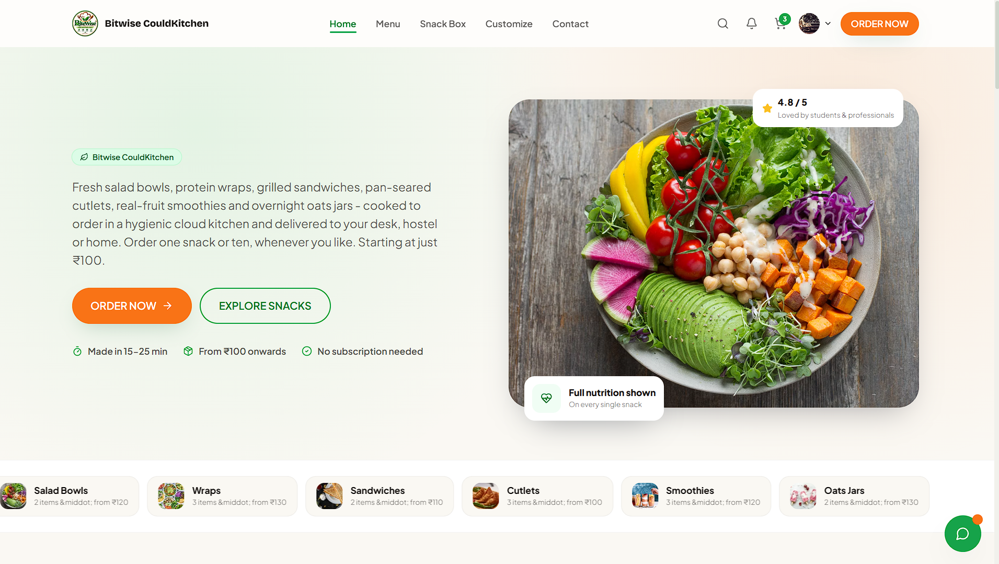
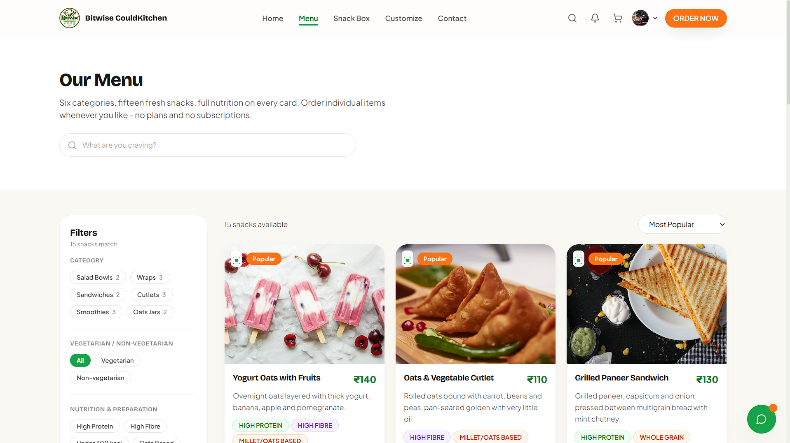
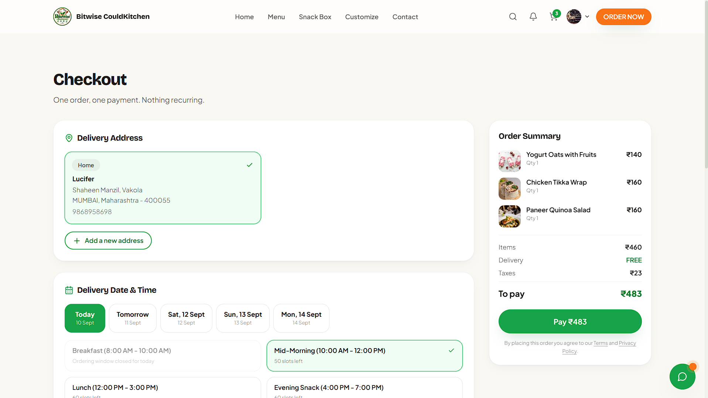
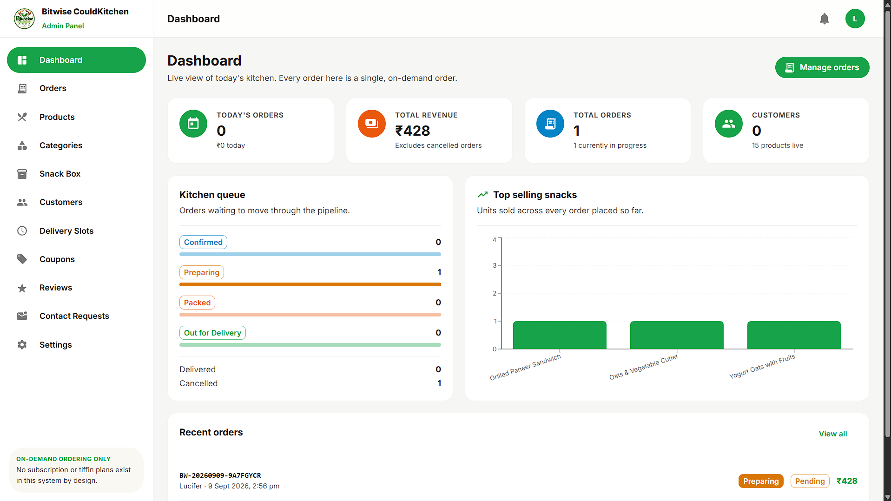
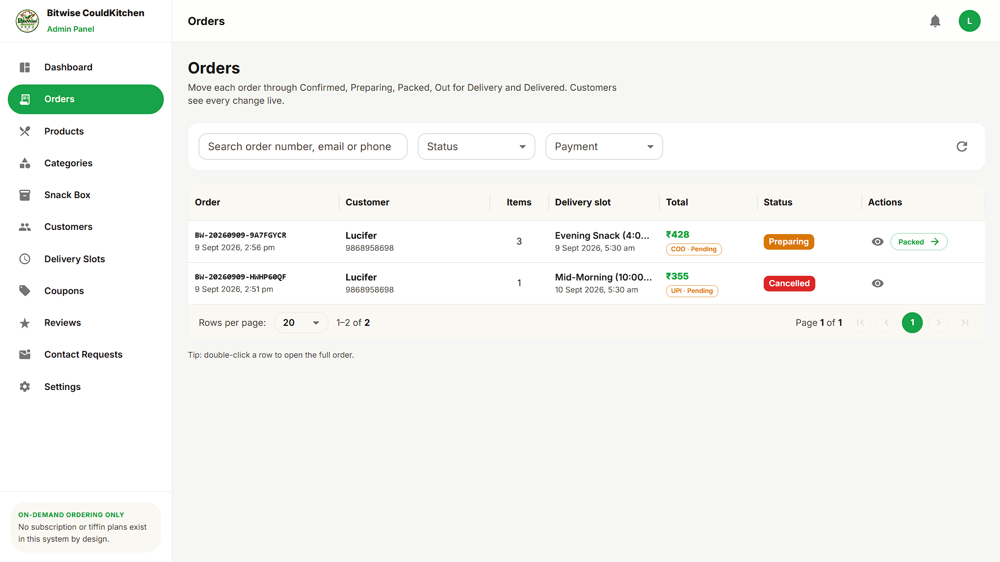

# 🍽️ CloudKitchen --- BiteWise

### Full-Stack Food Ordering & Kitchen Management Platform

CloudKitchen (BiteWise) is a full-stack food ordering platform built
with the MERN stack. It combines a customer-facing storefront, an admin
management dashboard, and a REST API backend into one application.

The project focuses on a practical e-commerce workflow: browsing
products, authentication, cart management, checkout, online payments,
order processing, product management, image uploads, and real-time
updates.

------------------------------------------------------------------------

## ✨ Highlights

-   🛒 Customer food/snack ordering experience
-   🔐 Authentication and protected application flows
-   🍔 Product/menu browsing and management
-   🛍️ Cart and checkout workflow
-   💳 Razorpay payment integration
-   ☁️ Cloudinary image storage
-   👨‍💼 Dedicated admin dashboard
-   📦 Order management and status updates
-   ⚡ Socket.IO-powered real-time communication
-   📊 Admin analytics and data visualization
-   🔎 Form validation with React Hook Form and Zod
-   🛡️ Backend security middleware and request protection
-   📱 Responsive UI for customer-facing pages

------------------------------------------------------------------------

## 🖥️ Application Screenshots

> Add your actual screenshots to `screenshots/` and replace the
> placeholders below.

### Customer Storefront



### Menu / Products



### Cart & Checkout



### Admin Dashboard



### Order Management



------------------------------------------------------------------------

## 🏗️ Architecture

CloudKitchen is organized as three applications:

``` text
CloudKitchen/
│
├── client/                 # Customer-facing React application
│   ├── src/
│   ├── public/
│   └── package.json
│
├── admin/                  # Admin dashboard
│   ├── src/
│   ├── public/
│   └── package.json
│
├── server/                 # Node.js / Express API
│   ├── src/
│   └── package.json
│
├── .gitignore
└── README.md
```

### Application Flow

``` text
                    ┌─────────────────────┐
                    │   Customer Client   │
                    │   React + Vite      │
                    └──────────┬──────────┘
                               │
                               │ REST API
                               ▼
                    ┌─────────────────────┐
                    │    Express Server   │
                    │   Node.js Backend   │
                    └──────┬───────┬──────┘
                           │       │
              ┌────────────┘       └─────────────┐
              ▼                                  ▼
     ┌─────────────────┐                ┌─────────────────┐
     │    MongoDB      │                │ External APIs   │
     │    Mongoose     │                │ Razorpay        │
     └─────────────────┘                │ Cloudinary      │
                                        └─────────────────┘

                    ┌─────────────────────┐
                    │    Admin Dashboard  │
                    │     React + Vite    │
                    └──────────┬──────────┘
                               │
                               │ REST API / Socket.IO
                               ▼
                    ┌─────────────────────┐
                    │    Express Server   │
                    └─────────────────────┘
```

------------------------------------------------------------------------

## 🛠️ Tech Stack

### Frontend --- Customer

  Technology         Purpose
  ------------------ -------------------------------
  React 18           UI development
  Vite               Development and build tooling
  Tailwind CSS       Styling and responsive UI
  React Router       Client-side routing
  Axios              API communication
  React Hook Form    Form management
  Zod                Validation
  Framer Motion      UI animations
  Swiper             Sliders and carousels
  Socket.IO Client   Real-time communication
  Lucide React       Icons

### Frontend --- Admin

  Technology         Purpose
  ------------------ -------------------------------
  React 18           Admin interface
  Vite               Development and build tooling
  Material UI        UI components
  MUI X Data Grid    Tabular data management
  Recharts           Analytics and charts
  React Router       Routing
  Axios              API communication
  Socket.IO Client   Real-time communication

### Backend

  Technology    Purpose
  ------------- -------------------------------
  Node.js       Runtime
  Express.js    REST API
  MongoDB       Database
  Mongoose      MongoDB ODM
  JWT           Authentication
  bcryptjs      Password hashing
  Zod           Request/data validation
  Socket.IO     Real-time communication
  Cloudinary    Image storage
  Multer        File uploads
  Razorpay      Online payments
  Nodemailer    Email functionality
  Google Auth   Google authentication support
  Winston       Application logging

### Security & Middleware

-   Helmet
-   express-rate-limit
-   express-mongo-sanitize
-   xss
-   JWT-based authentication
-   bcryptjs password hashing
-   Zod validation

### Development Tools

-   Git
-   GitHub
-   VS Code
-   Nodemon
-   Nginx
-   PM2

------------------------------------------------------------------------

## 🔄 Core Order Flow

``` text
Browse Products
      ↓
View Product
      ↓
Add to Cart
      ↓
Review Cart
      ↓
Checkout
      ↓
Razorpay Payment
      ↓
Order Created
      ↓
Admin Receives Order
      ↓
Order Status Updated
      ↓
Customer Tracks Order
```

------------------------------------------------------------------------

## 📁 Project Structure

``` text
CloudKitchen/
│
├── admin/
│   ├── public/
│   ├── src/
│   │   ├── components/
│   │   ├── pages/
│   │   ├── services/
│   │   └── ...
│   ├── package.json
│   └── vite.config.js
│
├── client/
│   ├── public/
│   ├── src/
│   │   ├── components/
│   │   ├── pages/
│   │   ├── services/
│   │   └── ...
│   ├── package.json
│   └── vite.config.js
│
├── server/
│   ├── src/
│   │   ├── controllers/
│   │   ├── models/
│   │   ├── routes/
│   │   ├── middleware/
│   │   ├── services/
│   │   ├── seed/
│   │   └── server.js
│   └── package.json
│
├── .gitignore
└── README.md
```

------------------------------------------------------------------------

## 🚀 Getting Started

### Prerequisites

Make sure you have installed:

-   Node.js
-   npm
-   MongoDB or a MongoDB connection
-   Git

You will also need credentials/configuration for the third-party
services used by the application, such as Razorpay and Cloudinary.

------------------------------------------------------------------------

## 1. Clone the Repository

``` bash
git clone https://github.com/Qureshi-Saud/Bitwise-CloudKitchen.git
cd Bitwise-CloudKitchen
```

------------------------------------------------------------------------

## 2. Install Dependencies

### Customer Client

``` bash
cd client
npm install
```

### Admin Dashboard

``` bash
cd ../admin
npm install
```

### Backend

``` bash
cd ../server
npm install
```

------------------------------------------------------------------------

## 3. Configure Environment Variables

Environment variable templates are provided in:

``` text
client/.env.example
admin/.env.example
server/.env.example
```

Create the corresponding `.env` files and add your own configuration
values.

### Windows CMD

From each application directory:

``` cmd
copy .env.example .env
```

Then update the values inside `.env` according to the required
configuration.

> Never commit real `.env` files or API credentials to GitHub.

------------------------------------------------------------------------

## 4. Start the Applications

You will normally run the customer client, admin dashboard, and backend
in separate terminals.

### Terminal 1 --- Backend

``` bash
cd server
npm run dev
```

### Terminal 2 --- Customer Client

``` bash
cd client
npm start
```

### Terminal 3 --- Admin Dashboard

``` bash
cd admin
npm start
```

------------------------------------------------------------------------

## 🌱 Database Seeding

The server provides seed scripts.

### Standard seed

``` bash
cd server
npm run seed
```

### Fresh seed

``` bash
npm run seed:fresh
```

Use the fresh seed command only when you intentionally want to
reset/reseed the supported seed data.

------------------------------------------------------------------------

## 📜 Available Scripts

### Client

``` bash
npm start
npm run build
npm run preview
```

### Admin

``` bash
npm start
npm run build
npm run preview
```

### Server

``` bash
npm run dev
npm start
npm run seed
npm run seed:fresh
```

------------------------------------------------------------------------

## 🔌 Integrations

### Razorpay

Used for online payment processing during checkout.

### Cloudinary

Used for cloud-based image storage and media handling.

### Socket.IO

Used for real-time communication between the applications and backend.

### MongoDB

Stores application data such as users, products, carts, orders, and
related records.

------------------------------------------------------------------------

## 🔐 Security

The backend includes several security-focused measures and middleware,
including:

-   HTTP security headers with Helmet
-   Rate limiting
-   MongoDB query sanitization
-   XSS protection
-   Password hashing
-   JWT-based authentication
-   Input/data validation with Zod
-   Environment-based configuration for secrets

Sensitive credentials are intentionally excluded from the repository
through `.gitignore`.

------------------------------------------------------------------------

## 📈 Future Improvements

Potential next steps for the project include:

-   Automated unit and integration testing
-   End-to-end testing for critical customer flows
-   CI/CD pipeline
-   Improved delivery/order tracking
-   Push notification support
-   More advanced admin analytics
-   Performance monitoring and observability
-   Production deployment documentation

------------------------------------------------------------------------

## 🎯 Project Goals

This project was built to demonstrate practical full-stack development
skills across:

-   React application development
-   REST API design
-   MongoDB data modeling
-   Authentication and authorization
-   E-commerce workflows
-   Payment integration
-   File/media management
-   Admin dashboard development
-   Real-time application communication
-   Responsive UI development
-   Backend security practices

------------------------------------------------------------------------

## 👨‍💻 Author

### Saud Qureshi

Full-Stack Web Developer

-   GitHub: https://github.com/Qureshi-Saud
-   LinkedIn: https://www.linkedin.com/in/qureshi-saud/

------------------------------------------------------------------------

## 📌 Repository

[](https://github.com/Qureshi-Saud/Bitwise-CloudKitchen)

------------------------------------------------------------------------

## ⭐ Support

If you find this project useful or interesting, consider giving the
repository a ⭐ on GitHub.
